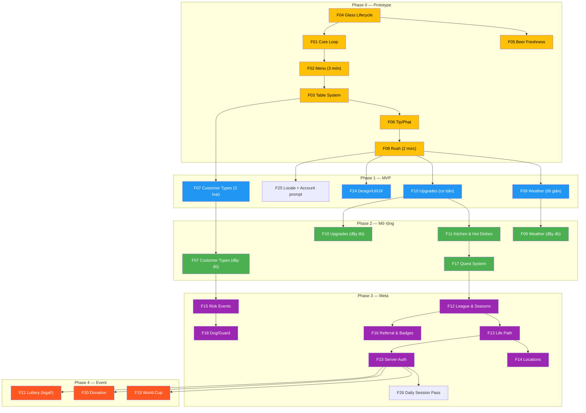

# 🗺️ ROADMAP — Trùm Bia Hơi v2.6

> **Roadmap sản phẩm.** Đây là **công cụ truyền đạt định hướng**, không phải project plan chi tiết — tasks cụ thể nằm ở các SPEC.
> **Nguồn sự thật về quyết định/số = GDD** (`02-GDD-trum-bia-hoi.md`); roadmap mâu thuẫn GDD thì GDD thắng.
> **Ngày:** 2026-07-15. **Nhãn:** 🟢 CORE · 🟡 PROTOTYPE · 🔵 POST-MVP.

---

## 📊 Overall Progress

> 🚀 **Tổng tiến độ: ~22%** — ████░░░░░░░░░░░░░░░░ (Spec + prototype code xong · automated k/loss gate pass · chờ Alpha feel)
>
> ℹ️ **Lưu ý KPI:** mọi target KPI dưới đây (retention, conversion, EV…) là **benchmark provisional theo chuẩn ngành**, KHÔNG rút từ GDD — chốt lại khi có data playtest thật.

| | Phase | Trạng thái | Outcome cần đạt |
|---|---|---|---|
| **NOW** | Phase 0 — Prototype | 🟡 **Automated gate pass — chờ Alpha playtest feel** | Biết core có *feel* đúng + `k_value` thật |
| **NOW** | Design Track (song song P0) | 🟡 **Khung spec xong** | Tokens + wireframe + quyết định art pipeline |
| **NEXT** | Phase 1 — MVP + Art v1 | ⚪ Not started | Vòng lặp ca vui & economy cân, có art thật |
| **LATER** | Phase 2 — Mở rộng core | ⚪ Not started | Đủ chiều sâu gameplay (6 món, khách đặc biệt) |
| **LATER** | Phase 3 — Meta & social | 🔵 Not started | Giữ chân + đua hạng (league, Life Path, cosmetic) |
| **LATER** | Phase 4 — Event & sink | 🔵 Cần review | World Cup / donation / xổ số (legal) |

Thiết kế & nghiên cứu (GDD v1.5, MAP v0.9, 3 SPEC triển khai/khung: `03`/`04`/`05`) **đã xong**. Ranh giới NOW = chuyển từ thiết kế sang code + design khung; art thật bắt đầu Phase 1.

---

## 👥 Team & Tracks

> Dự án có đủ team → các track **có thể song song** (khác với tuần tự solo dev). Roadmap phân chia theo **4 track** chạy đồng thời khi vào Phase 1+.

| Track | Phạm vi | Bắt đầu chạy song song |
|---|---|---|
| 🎮 **Code (Gameplay)** | Core loop, state machines, economy logic; server khi sang MVP/meta | Phase 0 |
| 🎨 **Design / Art** | Tokens, wireframes, sprites, animation, UI | Phase 0 (khung) → Phase 1 (sản xuất) |
| 🔊 **Audio** | SFX, ambient, music, microcopy voice | Phase 1 |
| ⚖️ **Economy / Balance** | k-value, playtesting, tuning numbers, QA | Phase 0 (đo) → mọi phase |

### Track Dependencies

```
Phase 0:  Code ████████████████  (prototype — placeholder art)
          Design ░░░░████████░░  (tokens + wireframe — không code)
          Economy ░░░░░░░░████  (đo k, playtest feel)

Phase 1:  Code ████████████████  (MVP logic + server tối thiểu nếu cần)
          Design ████████████░░  (asset production, implement UI)
          Audio ░░░░████████░░  (SFX + ambient)
          Economy ████████████  (balance liên tục)

Phase 2+: Tất cả tracks song song, cadence 2 tuần review.
```

---

## 📦 Feature Modules

> **Feature progress: ~22%** — ████░░░░░░░░░░░░░░░░ (Spec 100% · Code: lõi Phase 0 đã chạy, các phase sau 0%)

| # | Feature | Mô tả ngắn | Phase | Spec | Code | Art | Balance |
|---|---------|-------------|:-----:|:----:|:----:|:---:|:-------:|
| F01 | **Core Loop** | Ca 12 phút, thể lực, trần ngày 500k xu | 0–1 | ✅ | 🟡 | — | ⬜ |
| F02 | **Menu & Economy** | 6 món, giá/vốn/margin, k-value rescale | 0–1 | ✅ | 🟡 | ⬜ | 🟡 |
| F03 | **Table System** | 4 cấp bàn, nhóm, serve theo Order, mua/nâng cấp | 0–1 | ✅ | 🟡 | ⬜ | ⬜ |
| F04 | **Glass Lifecycle** | Bottleneck cốc: clean→in_use→dirty→washing→clean | 0 | ✅ | ✅ | ⬜ | ⬜ |
| F05 | **Beer Freshness** | Mất hơi 12s, cờ vàng, hậu quả MVP mềm | 0 | ✅ | ✅ | ⬜ | ⬜ |
| F06 | **Tip / Uy tín / Phạt** | Công thức tip, VIP ×10, phạt cụm, grace window | 0–1 | ✅ | 🟡 | — | ⬜ |
| F07 | **Customer Types** | 6 loại khách (thường/vội/VIP/Chí Phèo/ngồi lỳ/shipper) | 1–2 | ✅ | 🟡 | ⬜ | ⬜ |
| F08 | **Rush System** | P0: normal/peak toggle; P1: rush đơn giản; P2: lịch/full 90s/150s | 0–2 | ✅ | 🟡 | ⬜ | ⬜ |
| F09 | **Weather** | 5 loại thời tiết, hệ số ảnh hưởng freshness/tip/spawn | 1–2 | ✅ | ⬜ | ⬜ | ⬜ |
| F10 | **Upgrades** | Bom/rửa/hầm/quầy/bếp × 5 cấp, đường cong giá ×k | 1–2 | ✅ | ⬜ | ⬜ | ⬜ |
| F11 | **Kitchen & Hot Dishes** | Bếp 2 cấp, 3 mồi nóng (đậu/tóp mỡ/lòng), prep time | 2 | ✅ | ⬜ | ⬜ | ⬜ |
| F12 | **League & Seasons** | 8 bậc, 2 mùa song song, leaderboard + Dạo Phố | 3 | ✅ | ⬜ | ⬜ | ⬜ |
| F13 | **Life Path** | LP0–LP7, mốc trọn đời, gate tính năng & mặt bằng | 3 | ✅ | ⬜ | ⬜ | ⬜ |
| F14 | **Locations** | 9 mặt bằng vỉa hè, multiplier, rent/cọc 7 ngày | 3 | ✅ | ⬜ | ⬜ | ⬜ |
| F15 | **Risk Events** | Bảo kê, kiểm tra ATTP, say xỉn, trộm offline | 3 | ✅ | ⬜ | ⬜ | ⬜ |
| F16 | **Referral & Badges** | 3 mốc, huy hiệu Kết Nối gate bàn VIP | 3 | ✅ | ⬜ | — | ⬜ |
| F17 | **Quest System** | 7 nhánh nhiệm vụ (ngày/ca/gift/điểm danh/referral/LP) | 2–3 | ✅ | ⬜ | ⬜ | ⬜ |
| F18 | **Dog / Guard** | Mua chó, nâng cấp, combat bảo kê, bảo hiểm trộm | 3 | ✅ | ⬜ | ⬜ | ⬜ |
| F19 | **World Cup Event** | Lịch + tỉ số thật, TV, rush "xem bóng", combo; **shop mùa giải** (TV gate, lịch booster, **theme đội cosmetic mua bằng xu**) — GDD §14.0 | 4 | ✅ | ⬜ | ⬜ | ⬜ |
| F20 | **Donation** | "Mời Bia" — cosmetic-only, KHÔNG pay-to-win | 4 | ✅ | ⬜ | ⬜ | — |
| F21 | **Lottery** | Xổ số kiến thiết/Vietlott, **cần legal review** | 4 | ✅ | ⬜ | ⬜ | ⬜ |
| F22 | **AI Assistant** | Tư vấn realtime, LLM server-side, quota 20/ngày | 3+ | ✅ | ⬜ | — | — |
| F23 | **Server Architecture** | Server tối thiểu nếu cần → server-authoritative đầy đủ, websocket, CAPTCHA, anti-cheat | 1–3 | ✅ | ⬜ | — | — |
| F24 | **Design / UI / UX** | Tokens, wireframes, sprites, animation, art direction | 1+ | ✅ | — | ⬜ | — |
| F25 | **Localization / Account Login** | Chọn ngôn ngữ vi/en, guest play, Google login, cloud save, leaderboard prompt | 1+ | ✅ | ⬜ | ⬜ | — |
| F26 | **Daily Session Pass / Payments** | Free 1 session/ngày; paid unlock toàn bộ daily sessions theo cap | 3+ | ✅ | ⬜ | ⬜ | 🟡 |

> **Đọc cột "Spec":** ✅ = **đã thiết kế trong GDD** (đủ để hiểu/ưu tiên), KHÔNG có nghĩa "đã code". Spec triển khai hiện có: F03 (`03-SPEC-he-ban.md`); F01/F02/F04/F05/F06/F08 P0 (`04-SPEC-prototype-phase0.md`); F07-F26 (`docs/features/Fxx-*.md`, riêng F19 có thêm `07-SPEC-shop-mua-giai-worldcup.md`). Các feature sau Phase 0 vẫn phải chờ đúng phase/playtest gate trước khi code. F21 vẫn cần legal review; F26 cần payment/provider review.

> **Đọc cột "Code":** ✅ = đã code đủ phạm vi feature · 🟡 = **đã code phần lõi Phase 0**, còn phần phase sau (vd F02 mới 3/6 món · F03 chưa có 4 cấp bàn/mua-nâng cấp · F06 mới có tip, chưa uy tín/phạt cụm · F07 mới 3/6 loại khách · F08 mới toggle normal/peak) · ⬜ = chưa code. Lõi prototype nằm ở `prototype/src/{engine,sim,ui}`; build và 5-seed `k_value` gate đã pass, còn Alpha playtest feel trước khi qua exit-gate.

---

## 📅 Timeline

```
2026
 Jun            Jul            Aug            Sep            Oct            Nov
  |──── P0 ────|─────── Phase 1: MVP + Art v1 ──────|─── Phase 2 ───|
  |  Prototype |  Code: core loop + economy          |  6 món + bếp  |
  |  (validate |  Art: tokens → wireframe → assets   |  khách đặc biệt|
  |   feel+k)  |  Audio: SFX đầu tiên                |  rush đầy đủ  |
  |            |  Economy: balance liên tục           |  nâng cấp full |
  |            |                                      |               |
  |  Design:   |                    Playtest ──────────────────────── |
  |  tokens +  |                    Sprint 1   Sprint 2              |
  |  wireframe |                                                     |

                                                       Nov      Dec+
                                                        |──── Phase 3 ────|── Phase 4 ──|
                                                        | League + Life   | World Cup   |
                                                        | Path + locations| Donation    |
                                                        | Risk events     | Lottery     |
                                                        | Server-auth     | (legal!)    |
```

> ⚠️ Timeline là **estimate**, không phải cam kết cứng. Thực tế phụ thuộc exit gate mỗi phase.

---

## 🔗 Dependency Map



**Legend:** 🟡 Phase 0 | 🔵 Phase 1 | 🟢 Phase 2 | 🟣 Phase 3 | 🔴 Phase 4

---

## 🟡 NOW — Phase 0: Prototype (validate feel + đo k)

**Outcome:** Trả lời 5 câu hỏi prototype (feel mất hơi · feel bàn nhóm · nhịp tay 2 rush · bottleneck cốc · `k_value` thật).
**Spec:** `04-SPEC-prototype-phase0.md`.
**Tracks active:** Code + Economy. Design chạy khung (song song).

| Hạng mục | Track | Trạng thái | Ghi chú |
|---|---|---|---|
| Spec Phase 0 | — | ✅ Done | `04-SPEC` v0.2 |
| Chốt stack thực thi | Code | ✅ Done | **Pixi + React + Vite + TS** (đích GDD) |
| Scaffold loop (spawn · serve · vòng đời cốc · log) | Code | ✅ Done | `prototype/src/engine` — state machine đủ; `tsc` pass |
| Chạy ca + thu log + tính k | Economy | ✅ Automated pass | 5 seed, mỗi seed ≥503 lượt; k=2.24–2.34; aggregate loss fail-closed. |
| Design tokens + wireframe (khung) | Design | 🟡 In-progress | `tokens.ts` + placeholder Pixi assets; wireframe thật chờ |

### Phase 0 KPI

| Metric | Target | Hiện tại | Ghi chú |
|---|---|---|---|
| k_value | 2.0–3.0 (ổn định) | **2.24–2.34** qua 5 seed | Automated pass; hand-play vẫn phải xác nhận |
| % cốc hết hơi (playtest) | 5–15% | N/A | Quá thấp → giảm base; quá cao → tăng |
| % khách bỏ đi (normal rush) | <10% | **0% bot / 5 seed** | Peak diagnostic 26.1–40.8%; ngưỡng feel cuối do Alpha quyết định |
| Thời gian playtest mỗi ca | ~12 phút | N/A | Đúng thiết kế |
| Cảm nhận bottleneck cốc | "Rõ ràng là nghẽn" | N/A | Nâng rửa → đỡ ngay |

### Exit Gate → Phase 1

| Tiêu chí | PASS | Tín hiệu cần chỉnh |
|---|---|---|
| k_value | Ổn định 2.0–3.0 qua nhiều ca | Lệch xa → cập nhật k |
| Mất hơi | Người chơi chủ động giãn nhịp rót, hiếm phạt oan | Luôn dính phạt → tăng base 12s |
| Bàn nhóm | Phục vụ theo bàn rõ ràng, không rối | Rối → xem lại gom Order |
| Bottleneck cốc | Cốc/rửa là nghẽn chính; nâng rửa đỡ ngay | Không nghẽn → giảm cốc/tăng wash time |
| Nhịp 2 rush | Peak dồn dập mà vẫn xử được | Quá tải/nhạt → chỉnh spawn |
| **Prototype KHÔNG cần:** | Art đẹp, UX polish, meta, event | Placeholder thuần |

### 📊 Phase 0 Summary

| Track | Scope | Status |
|---|---|---|
| 🎮 Code | Scaffold + state machine + log | ✅ Done (engine+UI+sim, `tsc` pass) |
| 🎨 Design | Tokens + wireframe (khung, không block code) | 🟡 Tokens + placeholder; wireframe thật chờ |
| ⚖️ Economy | Đo k, playtest feel | 🟡 Automated k/loss pass; Alpha feel pending |

---

## 🟢 NEXT — Phase 1: MVP (core feel + economy) + Art v1

**Outcome:** Chứng minh vòng lặp vận hành ca **vui & economy cân**, lần đầu có **art/UIUX thật**. KHÔNG nhồi meta/event.
**Tracks active:** Tất cả 4 track song song.

Gồm (GDD §19 + `03-SPEC-he-ban.md`):
- Ca 12 phút + thể lực + trần ngày (rescaled ×k đã đo).
- 2–3 loại bàn (mua thêm + nâng sức chứa).
- Bia + 2–3 mồi (chưa cần đủ 6 món/bếp).
- Freshness cốc (hậu quả MVP mềm: tip×0 + uy tín −1).
- Vòng đời cốc + rửa; tip/patience/phạt; rush 1 mức.
- Nâng cấp cơ bản (bom/rửa/hầm/bàn); thời tiết tối giản.
- **Design track:** chốt tokens (màu/font/spacing), vẽ 5 wireframe, sản xuất asset/icon → thay placeholder bằng art thật.
- **Audio track:** SFX gameplay (rót bia, chạm ly, khách gọi), ambient quán.
- **Onboarding:** chọn ngôn ngữ `vi/en`; guest play; prompt đăng nhập Google để lưu tiến trình/đua top.

### Phase 1 KPI

| Metric | Target | Ghi chú |
|---|---|---|
| Session length trung bình | 10–14 phút | Đúng thiết kế ca 12 phút |
| "Muốn chơi ca tiếp" score | ≥7/10 | Playtest survey |
| Economy balance | Không vỡ (chạm trần vừa đủ) | Không quá dễ/vô tận |
| Art completion | ≥80% MVP assets | Sprites + HUD + icons |
| Bug rate (P0/P1) | 0 crash, <5 gameplay bugs | Smoke test sau mỗi sprint |

### Exit Gate → Phase 2

Một nhóm playtester thấy **"1 ca vui, muốn chơi ca tiếp"**; economy không vỡ (không quá dễ chạm trần / không cày vô tận).

**Phụ thuộc:** Phase 0 đã chốt k & feel · quyết định stack (kế thừa) · quyết định "tự vẽ / thuê / asset pack" cho art.

### 📊 Phase 1 Summary

| Track | Scope | Status |
|---|---|---|
| 🎮 Code | Core loop + 3 loại bàn + economy + upgrades cơ bản | ⬜ |
| 🎨 Design/Art | Tokens → wireframe → sprite production → UI implement | ⬜ |
| 🔊 Audio | SFX gameplay + ambient quán | ⬜ |
| ⚖️ Economy | Balance liên tục, playtest sessions | ⬜ |
| 🧾 Account | Locale picker + guest/login prompt + save migration design | ⬜ |

---

## 🔵 LATER — Phase 2: Mở rộng core

**Outcome:** Đủ chiều sâu gameplay sau khi feel lõi đã đúng.

Features chính:
- Đủ **6 món + bếp** (F11 Kitchen) · rush đầy đủ/lịch tự động (F08) · thời tiết đầy đủ (F09).
- Loại khách đặc biệt đầy đủ (F07: VIP / Chí Phèo / ngồi lỳ / shipper).
- Nâng cấp đầy đủ (F10) · quà cốc (Chí Phèo → Chủ tịch +1 cốc, nối risk↔throughput).
- Quest system cơ bản (F17: nhiệm vụ ngày + ca).

### Phase 2 KPI

| Metric | Target | Ghi chú |
|---|---|---|
| Session count/ngày | ≥3 ca/ngày (per tester) | Retention signal |
| Feature engagement | ≥60% playtester thử tất cả loại khách | Breadth |
| Economy balance (6 món) | k vẫn trong 2.0–3.0 sau thêm món | Rebalance |
| Bug rate | <3 P1 bugs per sprint | Quality gate |

### Exit Gate → Phase 3

Economy vẫn cân sau khi thêm món/khách (k không lệch); mọi loại khách có vai trò rõ; bếp + prep time tạo quyết định chiến thuật mới.

**Phụ thuộc:** Phase 1 economy đã cân (thêm món/khách mà chưa cân sẽ phá balance).

### 📊 Phase 2 Summary

| Track | Scope | Status |
|---|---|---|
| 🎮 Code | Kitchen, full customers, full rush, full weather, quests | ⬜ |
| 🎨 Art | Sprite khách đặc biệt ×hot/cold, bếp 2 cấp, 3 mồi nóng | ⬜ |
| 🔊 Audio | SFX khách đặc biệt, weather ambient, rush tension | ⬜ |
| ⚖️ Economy | Rebalance k với 6 món, tune quest rewards | ⬜ |

---

## 🔵 LATER — Phase 3: Meta & social

**Outcome:** Lớp giữ chân + đua hạng.

Features chính:
- League theo mùa (F12) + Life Path LP0–LP7 (F13) + 9 mặt bằng (F14).
- 8 huy hiệu + referral (F16) + cosmetic (biển hiệu, đèn lồng, cây cảnh).
- Bảo kê + kiểm tra ATTP + trộm offline (F15) + chó/bảo vệ (F18).
- AI assistant (F22, tùy feasibility).
- **Server-authoritative đầy đủ** (F23: chống gian lận, xếp hạng công bằng; nếu Phase 1 mới chỉ client/server tối thiểu thì đây là lúc nâng lên full).
- **Session Pass / payment** (F26): free 1 session/ngày, paid unlock daily cap; cần account + payment provider.
- 3 vòng UX (Operate/Learn/Belong).

### Phase 3 KPI

| Metric | Target | Ghi chú |
|---|---|---|
| D1 retention | ≥40% | First session → next day |
| D7 retention | ≥20% | Weekly stickiness |
| League participation | ≥60% active players | Engagement with meta |
| Avg sessions/week | ≥5 | Healthy engagement |
| Anti-cheat coverage | 100% mutating actions server-validated | Security |
| Payment entitlement accuracy | 0 double-grant / 0 missed paid entitlements | Billing correctness |

### Exit Gate → Phase 4

League/Life Path tạo mục tiêu dài hạn rõ; server-auth chặn gian lận; retention D7 ≥20%.

**Phụ thuộc:** nâng từ client-only/server tối thiểu → server thật (quyết định kiến trúc lớn) · core gameplay (Phase 1–2) đã ổn định.

### 📊 Phase 3 Summary

| Track | Scope | Status |
|---|---|---|
| 🎮 Code | Server-auth, league, Life Path, locations, risk events, referral | ⬜ |
| 🎨 Art | 9 mặt bằng, gangster sprites, cosmetic items, badges | ⬜ |
| 🔊 Audio | Combat SFX, location ambient, seasonal music | ⬜ |
| ⚖️ Economy | League thresholds, rent/cọc curve, quest balance full | ⬜ |
| 💳 Access | Google account, guest migration, daily session pass, payment entitlement | ⬜ |

---

## 🔵 LATER — Phase 4: Event & sink (cần review)

**Outcome:** Lớp phủ sự kiện + sink tiền tệ.
- 🔵 **Event World Cup** (F19: lịch + tỉ số thật → cần nguồn API).
- 🔵 **Donation "Mời Bia"** (F20: cosmetic-only, không P2W).
- 🔵 **Xổ số / Vietlott** (F21) — **chỉ sau legal review** (cờ bạc); currency sink, không cá độ, không P2W.

### Phase 4 KPI

| Metric | Target | Ghi chú |
|---|---|---|
| Event participation | ≥50% DAU trong mùa World Cup | Engagement |
| Donation conversion | ≥2% DAU | Revenue signal |
| Lottery EV | 0.6–0.8 (net SINK) | Economy health |
| D30 retention | ≥10% | Long-term stickiness |

**Phụ thuộc:** server (Phase 3) · **legal review** (chặn xổ số) · chốt nguồn API tỉ số/lịch.

### 📊 Phase 4 Summary

| Track | Scope | Status |
|---|---|---|
| 🎮 Code | WC event engine, donation flow, lottery (nếu pass legal) | ⬜ |
| 🎨 Art | TV sprite, WC decorations, donation cosmetics | ⬜ |
| 🔊 Audio | Crowd cheering, match ambient | ⬜ |
| ⚖️ Economy | Lottery EV tuning, donation pricing, event balance | ⬜ |

---

## 🧪 Playtest & Validation Plan

> Học từ WorkState (pilot interviews) + game dev best practices. Game cần **playtest milestones** rõ ràng.

| Milestone | Phase | Ai test | Cỡ mẫu | Format | Mục tiêu |
|---|---|---|---|---|---|
| **Alpha playtest** | P0 xong | Team nội bộ | 3–5 người | Chơi 3+ ca, log k | Validate feel + đo k |
| **Closed playtest** | P1 xong | Bạn bè + gamers VN | 10–15 người | Build, survey Google Form | "1 ca vui, muốn chơi tiếp?" |
| **Balance playtest** | P2 xong | Closed beta | 20–30 người | 1 tuần chơi, analytics | Economy cân? Loại khách nào thiếu engagement? |
| **Meta playtest** | P3 xong | Open beta | 50–100 người | 2 tuần, leaderboard live | Retention D7 ≥20%? League tạo mục tiêu? |
| **Event playtest** | P4 xong | Public soft launch | 200+ người | Mùa WC/event live | Event tăng DAU? Donation conversion? |

### Playtest Protocol

1. **Trước mỗi session:** chuẩn bị build ổn định, survey form, analytics dashboard.
2. **Trong session:** không can thiệp; ghi nhận bug + feedback tự phát.
3. **Sau session:** survey (fun score 1–10, "muốn chơi tiếp?", "khó ở đâu?"); tổng hợp analytics.
4. **Decision:** kết quả playtest quyết định có qua exit gate không → ghi vào `SESSION-TRACK-LOG.md`.

---

## ⚠️ Rủi ro & Phụ thuộc xuyên suốt

| # | Rủi ro / phụ thuộc | Phase | Impact | Giảm thiểu |
|---|---|---|---|---|
| R1 | `k_value` đo lệch xa 2.5 | 0 | 🟡 Medium | Spec cho phép chỉnh k; chỉ *phương pháp* tính k là bất biến |
| R2 | Feel mất hơi quá gắt/quá nhạt | 0–1 | 🟡 Medium | Bắt đầu MVP mềm (tip×0), tinh chỉnh base 12s sau khi đo |
| R3 | Chuyển client-only/server tối thiểu → server đầy đủ | 1–3 | 🔴 High | Kiến trúc GDD §18 đã dự trù; tách rõ "thêm mới ≠ đổi kiến trúc" |
| R4 | Art: pipeline chưa chốt (tự vẽ/thuê/pack) | 1 | 🟡 Medium | Quyết sớm ở đầu Phase 1; Phase 0 không cần (placeholder) |
| R5 | Xổ số dính pháp lý | 4 | 🔴 High | Bắt buộc legal review trước khi build; mặc định để cuối |
| R6 | Economy vỡ khi thêm 6 món/khách đặc biệt | 2 | 🔴 High | Rebalance k sau mỗi feature; playtest liên tục |
| R7 | Scope creep (team muốn thêm feature) | Mọi phase | 🟡 Medium | Nguyên tắc cập nhật §dưới: "thêm thì phải bỏ/dời" |
| R8 | Team coordination overhead | Mọi phase | 🟡 Medium | Review cadence 2 tuần; exit gate chặt giữa phases |
| R9 | Playtest bias (team tự chơi = không khách quan) | 0–1 | 🟡 Medium | Closed playtest P1 dùng người ngoài team |
| R10 | Payment/session pass entitlement sai hoặc gây tranh cãi leaderboard | 3+ | 🔴 High | Server-side entitlement, idempotent webhook, copy rõ pay-for-access, cân nhắc leaderboard segmentation nếu cần |

---

## 💰 Monetization Reference

> Chi tiết xem GDD §16. Roadmap chỉ nhắc tóm tắt để align priorities.

**Model:** Free-to-start with account upsell, paid session access, and cosmetic donation.

| Nguyên tắc | Chi tiết |
|---|---|
| **Cosmetic-only** | Quà donation = đèn lồng / cây cảnh / biển hiệu. KHÔNG tặng gameplay advantage. |
| **Session Pass** | Free user 1 session/ngày; paid user unlock normal daily cap. Đây là pay-for-access, không grant tài nguyên trực tiếp. |
| **KHÔNG bán xu/power/hạng** | Không bán coins/materials/league points/Life Path. |
| **Gate gameplay free** | Gate gameplay (bàn VIP) CHỈ unlock bằng free progression / referral / uy tín. |
| **Cosmetic mua bằng xu = currency-sink** | Trang trí mua bằng xu in-game (vd **theme đội World Cup** §14.0, đèn/cây/biển) là **sink chống lạm phát**, cosmetic-only, không P2W — tách bạch hẳn với donation tiền thật. |

**Revenue streams tiềm năng:** Session Pass / Donation / In-game ads (cân nhắc) / Cosmetic shop mở rộng. **Xu-sink (theme đội, decor) không tạo doanh thu** — vai trò là chống lạm phát + bản sắc mùa giải.

---

## 🔄 Nguyên tắc cập nhật roadmap

1. Roadmap ở tầm **theme/outcome**, không phải task. Task ở SPEC.
2. Đổi thứ tự ưu tiên phải có **lý do mới** (đo được, feedback), không tùy hứng.
3. Thêm việc vào phase → phải hỏi **"bỏ/dời gì ra"** (capacity vẫn hữu hạn dù có team).
4. Cập nhật roadmap theo cadence tự nhiên (kết mỗi phase hoặc sau playtest milestone), không whiplash từng tin nhỏ.
5. Mỗi lần sửa → ghi changelog dưới + 1 block trong `SESSION-TRACK-LOG.md`.
6. **Feature Module Table** (§trên) phải được cập nhật mỗi khi feature thay đổi status.

---

## Changelog (append-only — thêm dòng mới, KHÔNG ghi đè)

| Ver | Thay đổi |
|---|---|
| v0.1 | Roadmap đầu: định dạng Now/Next/Later ánh xạ Phase 0–4 (từ GDD §19); thêm exit gate + phụ thuộc mỗi phase; design track gắn vào Phase 1; bảng rủi ro; nguyên tắc cập nhật. |
| v2.0 | **Viết lại toàn bộ.** Bỏ ràng buộc solo dev → team (4 track song song: Code/Design-Art/Audio/Economy). Thêm: Feature Module Table (24 features), KPI per phase, ASCII timeline, Mermaid dependency map, Phase Summary tables per track, Playtest & Validation Plan (5 milestones + protocol), Monetization reference (GDD §16), progress bar visual. Bổ sung rủi ro team (R7 scope creep, R8 coordination, R9 playtest bias). Giữ nguyên: triết lý outcome>task, nguồn sự thật=GDD, exit gate, nguyên tắc cập nhật. Kết hợp ưu điểm từ roadmap BotShop (feature table + Mermaid + KPI + monetization), MyMoneyWent (timeline + progress tracking), WorkState (playtest/pilot plan + exit criteria), CloudX (simplicity). |
| v2.1 | Audit alignment: MAP v0.9; làm rõ Phase 0 chỉ code + design khung/placeholder, art thật Phase 1; F08 rush chia đúng P0/P1/P2; F23/R3 server chia server tối thiểu vs server-authoritative đầy đủ; bỏ link `file://` trong spec ref. |
| v2.2 | Đồng bộ GDD v1.4: F19 thêm **shop mùa giải** (TV gate / lịch booster / **theme đội cosmetic mua bằng xu**, GDD §14.0); Monetization thêm nguyên tắc **cosmetic-mua-bằng-xu = currency-sink** (tách bạch donation, không P2W). |
| v2.3 | Thêm bộ spec triển khai `docs/features/F07-F24` cho các feature còn thiếu; roadmap giờ phân biệt rõ "đã có spec triển khai" với "đã code". |
| v2.4 | Thêm F25 Localization/Account Login và F26 Daily Session Pass/Payments; free user 1 session/ngày, paid unlock normal daily cap; cập nhật monetization từ donation-only sang free-to-start + access pass + cosmetic donation. |
| v2.5 | **Đồng bộ với code thực tế (2026-06-23).** Prototype Phase 0 đã được code (`prototype/src/{engine,sim,ui}`, ~2.100 dòng TS, `tsc` pass): F04/F05 ✅ đủ, F08 toggle normal/peak, F01/F02(3 món)/F03/F06(tip)/F07(3 loại) ở mức lõi Phase 0. Tổng tiến độ 15%→**22%**; cột Code F01–F08 ⬜→✅/🟡; bảng NOW + Phase 0 Summary chuyển sang Done/In-progress; thêm chú thích cột "Code"; còn thiếu **đo k_value** trước exit-gate. |
| v2.6 | **Đồng bộ Phase 0 automated gate (2026-07-15).** Cadence spawn sửa về nhịp mỗi khách; sim aggregate loss fail-closed; 5 seed k=2.24–2.34, normal loss 0%, peak loss 26.1–40.8%. Automated gate pass; không mở Phase 1 trước Alpha playtest feel. |

*Nguồn: `02-GDD-trum-bia-hoi.md` §19, `03-SPEC-he-ban.md`, `04-SPEC-prototype-phase0.md`, `05-SPEC-design-uiux.md`.*
