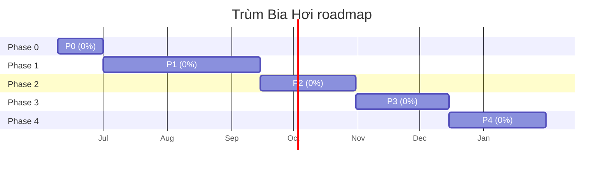

# Trùm Bia Hơi — Progress Dashboard

> **Auto-generated** từ [`implementation-tracker.md`](implementation-tracker.md) bằng `tools/dashboard-engine/build_dashboard.py`.
> KHÔNG edit trực tiếp — sửa tracker rồi rebuild.
> **Cập nhật:** 2026-06-11 18:33

Để xem dashboard HTML đẹp hơn: mở [`dashboard.html`](dashboard.html) bằng browser.

---

## Tổng quan

- **MVP progress:** **0%** (0/26 PR merged)
- **In flight:** 0 PR · **Blocked:** 0 · **Deferred:** 0
- **Target (estimate):** Phase 0 xong ~cuối T6/2026 · MVP ~T9/2026 (xem 06-ROADMAP)

## Phase progress

| Phase | Merged / Total | % | Progress |
|-------|:--------------:|:-:|:---------|
| Phase 0 | 0 / 7 | 0% | `░░░░░░░░░░` |
| Phase 1 | 0 / 5 | 0% | `░░░░░░░░░░` |
| Phase 2 | 0 / 2 | 0% | `░░░░░░░░░░` |
| Phase 3 | 0 / 9 | 0% | `░░░░░░░░░░` |
| Phase 4 | 0 / 3 | 0% | `░░░░░░░░░░` |

## Phase breakdown — features & tasks

### Phase 0 — 0/7 · 0% `░░░░░░░░░░`

| PR | Feature | Status | Branch |
|----|---------|:------:|--------|
| `F04` | Vòng Đời Cốc — bottleneck cốc clean→in_use→dirty→washing→clean | ⬜ Not started | `—` |
| `F01` | Vòng Lặp Mở Ca — ca 12 phút, thể lực, trần ngày 500k | ⬜ Not started | `—` |
| `F02` | Menu & Kinh Tế Quán — 3 món P0 (bia+2 mồi), đo k | ⬜ Not started | `—` |
| `F03` | Hệ Bàn — 3 bàn, serve theo Order | ⬜ Not started | `—` |
| `F05` | Độ Hơi Bia — mất hơi 12s, cờ vàng, MVP mềm | ⬜ Not started | `—` |
| `F06` | Tip / Uy tín / Phạt — VIP ×10, grace window | ⬜ Not started | `—` |
| `F08` | Giờ Vàng — 2 mức (nhẹ 90s/nặng 150s), spawn floor | ⬜ Not started | `—` |

### Phase 1 — 0/5 · 0% `░░░░░░░░░░`

| PR | Feature | Status | Branch |
|----|---------|:------:|--------|
| `F24` | Thiết Kế UI/UX Quán Bia — tokens, wireframe, sprite, animation | ⬜ Not started | `—` |
| `F07` | Các Kiểu Khách — 3 loại P1 (thường/vội/VIP) | ⬜ Not started | `—` |
| `F09` | Thời Tiết Quán — tối giản (hệ số độ hơi/tip/spawn) | ⬜ Not started | `—` |
| `F10` | Nâng Cấp Quán — bom/rửa/hầm/bàn cơ bản (×k) | ⬜ Not started | `—` |
| `F25` | Ngôn Ngữ / Tài Khoản — chọn vi/en, guest play, Google login | ⬜ Not started | `—` |

### Phase 2 — 0/2 · 0% `░░░░░░░░░░`

| PR | Feature | Status | Branch |
|----|---------|:------:|--------|
| `F11` | Bếp & Mồi Nóng — bếp 2 cấp, 3 mồi nóng | ⬜ Not started | `—` |
| `F17` | Nhiệm Vụ Quán Nhậu — 7 nhánh (ngày/ca/gift/điểm danh/referral/ĐLT) | ⬜ Not started | `—` |

### Phase 3 — 0/9 · 0% `░░░░░░░░░░`

| PR | Feature | Status | Branch |
|----|---------|:------:|--------|
| `F23` | Kiến Trúc Server Quán — server-auth, websocket, CAPTCHA | ⬜ Not started | `—` |
| `F12` | Giải Nhậu & Vụ Bia — 8 bậc, 2 Vụ Bia song song | ⬜ Not started | `—` |
| `F13` | Đường Lên Trùm — LP0–LP7, gate tính năng & mặt bằng | ⬜ Not started | `—` |
| `F14` | Mặt Bằng Quán — 9 mặt bằng, rent/cọc 7 ngày | ⬜ Not started | `—` |
| `F15` | Sự Cố Quán Nhậu — bảo kê, kiểm tra ATTP, trộm offline | ⬜ Not started | `—` |
| `F16` | Rủ Bạn & Huy Hiệu — 3 mốc, huy hiệu Kết Nối | ⬜ Not started | `—` |
| `F18` | Chó Giữ Quán — combat bảo kê, bảo hiểm trộm | ⬜ Not started | `—` |
| `F22` | Bia Đấm — LLM server-side, quota 20/ngày | ⬜ Not started | `—` |
| `F26` | Vé Mở Ca & Thanh Toán — free 1 ca/ngày, paid unlock daily cap | ⬜ Not started | `—` |

### Phase 4 — 0/3 · 0% `░░░░░░░░░░`

| PR | Feature | Status | Branch |
|----|---------|:------:|--------|
| `F19` | Cúp Bóng Đá — lịch + tỉ số thật, TV, Giờ Vàng xem bóng | ⬜ Not started | `—` |
| `F20` | Mời Bia Hơi — cosmetic-only, KHÔNG P2W | ⬜ Not started | `—` |
| `F21` | Vé Số Lấy Hên — xổ số/Vietlott, **cần legal review** | ⬜ Not started | `—` |

## Timeline

## Đang làm

_Không có PR active._

## Up next

| PR | Feature | Phase | Status |
|----|---------|-------|--------|
| `F04` | Vòng Đời Cốc — bottleneck cốc clean→in_use→dirty→washing→clean | Phase 0 | ⬜ Not started |
| `F01` | Vòng Lặp Mở Ca — ca 12 phút, thể lực, trần ngày 500k | Phase 0 | ⬜ Not started |
| `F02` | Menu & Kinh Tế Quán — 3 món P0 (bia+2 mồi), đo k | Phase 0 | ⬜ Not started |
| `F03` | Hệ Bàn — 3 bàn, serve theo Order | Phase 0 | ⬜ Not started |
| `F05` | Độ Hơi Bia — mất hơi 12s, cờ vàng, MVP mềm | Phase 0 | ⬜ Not started |

---

**Rebuild:** chạy `python tools/dashboard-engine/build_dashboard.py` sau mỗi PR merge (theo Step 10 của [development-workflow.md](operations/development-workflow.md) §2.7 Post-merge updates).
