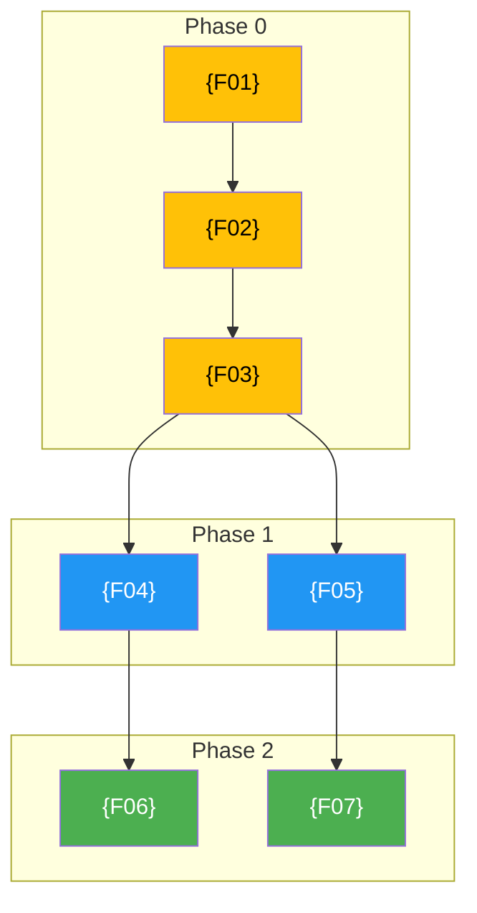

# 🗺️ ROADMAP — {PROJECT_NAME} v{VERSION}

> **Roadmap sản phẩm.** Đây là **công cụ truyền đạt định hướng**, không phải project plan chi tiết — tasks cụ thể nằm ở các SPEC/feature docs.
> **Nguồn sự thật:** `{SOURCE_OF_TRUTH_DOC}` (VD: BRD, GDD, PRD); roadmap mâu thuẫn nguồn sự thật thì nguồn sự thật thắng.
> **Ngày:** {DATE}. **Nhãn:** {LABEL_SYSTEM — VD: 🟢 CORE · 🟡 PROTOTYPE · 🔵 POST-MVP}.

<!-- 
╔══════════════════════════════════════════════════════════════════╗
║  HƯỚNG DẪN SỬ DỤNG TEMPLATE                                    ║
║                                                                  ║
║  1. Thay tất cả {PLACEHOLDER} bằng giá trị thật                ║
║  2. Xóa các comment hướng dẫn (<!-- -->) sau khi điền           ║
║  3. Xóa section không áp dụng (VD: Playtest nếu không phải     ║
║     game; Monetization nếu là internal tool)                    ║
║  4. Đọc [!TIP] blocks để hiểu best practice từng section       ║
║  5. Giữ nguyên Nguyên tắc cập nhật — đây là phần quan trọng    ║
║     nhất để roadmap không bị scope creep                        ║
║  6. ⚠️ RANH GIỚI: Roadmap = "làm gì, khi nào, ai, đo bằng gì" ║
║     Source doc (GDD/BRD/PRD) = "tại sao, cơ chế, công thức".   ║
║     Khi viết mà thấy đang giải thích CƠ CHẾ → dừng, trỏ link. ║
╚══════════════════════════════════════════════════════════════════╝
-->

---

## 📊 Overall Progress

> 🚀 **Tổng tiến độ: {N}%** — {PROGRESS_BAR — VD: ███░░░░░░░░░░░░░░░░░}

<!-- TIP: Progress bar dùng █ (filled) và ░ (empty), 20 ký tự = 100%. 
     VD: 30% = ██████░░░░░░░░░░░░░░ -->

| | Phase | Trạng thái | Outcome cần đạt |
|---|---|---|---|
| **NOW** | Phase 0 — {PHASE_NAME} | {STATUS — VD: 🟡 In Progress} | {1 câu mô tả outcome} |
| **NEXT** | Phase 1 — {PHASE_NAME} | ⚪ Not started | {1 câu mô tả outcome} |
| **LATER** | Phase 2 — {PHASE_NAME} | ⚪ Not started | {1 câu mô tả outcome} |
| **LATER** | Phase N — {PHASE_NAME} | ⚪ Not started | {1 câu mô tả outcome} |

<!-- TIP: Dùng Now/Next/Later thay vì chỉ Phase 0/1/2 — dễ hiểu hơn cho stakeholder.
     Số phase tùy dự án (3–5 là lý tưởng; >6 = over-planning). -->

{1–2 câu context: đã làm gì, ranh giới NOW ở đâu.}

---

## 👥 Team & Tracks

<!-- TIP: Nếu solo dev → ghi rõ "1 người, phases tuần tự, không song song".
     Nếu có team → liệt kê tracks song song. -->

| Track | Phạm vi | Bắt đầu chạy |
|---|---|---|
| {TRACK_1 — VD: 🎮 Code} | {Scope — VD: Backend + Frontend logic} | Phase 0 |
| {TRACK_2 — VD: 🎨 Design} | {Scope — VD: UI/UX, wireframes, assets} | Phase 0–1 |
| {TRACK_3 — VD: 🔊 Audio/Content} | {Scope — VD: SFX, copywriting} | Phase 1 |
| {TRACK_4 — VD: ⚖️ QA/Balance} | {Scope — VD: Testing, metrics, tuning} | Mọi phase |

<!-- THAY THẾ tracks phù hợp dự án:
     - SaaS: Backend / Frontend / Bot / QA
     - Game: Code / Art / Audio / Economy-Balance
     - Tool: Core / Integrations / UI / Docs
     - Content: Writing / Design / Dev / Marketing -->

### Track Parallelism

```
Phase 0:  Track1 ████████████████  (primary)
          Track2 ░░░░████████░░░░  (prep work)

Phase 1:  Track1 ████████████████  (primary)
          Track2 ████████████████  (full production)
          Track3 ░░░░████████░░░░  (starts mid-phase)
          Track4 ████████████████  (continuous)

Phase 2+: All tracks song song, review cadence {N} tuần.
```

---

## 📦 Feature Modules

> **Feature progress: {N}%** — {PROGRESS_BAR}

<!-- TIP: Đây là section QUAN TRỌNG NHẤT mà hầu hết roadmap thiếu.
     Liệt kê TẤT CẢ features của sản phẩm, map vào phase.
     Cột status tùy dự án: 
     - SaaS: Spec | BE | FE | Bot
     - Game: Spec | Code | Art | Balance
     - Tool: Spec | Core | UI | Tests

     ⚠️ RANH GIỚI: Cột "Mô tả ngắn" CHỈ ĐƯỢC 1 dòng tóm tắt.
     KHÔNG giải thích cơ chế, công thức, hay số cụ thể ở đây.
     Nếu cần chi tiết → trỏ sang feature doc / GDD section.
     Roadmap track TIẾN ĐỘ features, không ĐỊNH NGHĨA features. -->

| # | Feature | Mô tả ngắn | Phase | {COL_1} | {COL_2} | {COL_3} | {COL_4} |
|---|---------|-------------|:-----:|:-------:|:-------:|:-------:|:-------:|
| F01 | **{Feature Name}** | {Mô tả 1 dòng} | 0 | ✅ | ⬜ | ⬜ | ⬜ |
| F02 | **{Feature Name}** | {Mô tả 1 dòng} | 0–1 | ✅ | ⬜ | ⬜ | ⬜ |
| F03 | **{Feature Name}** | {Mô tả 1 dòng} | 1 | ✅ | ⬜ | ⬜ | ⬜ |
| ... | ... | ... | ... | ... | ... | ... | ... |

<!-- Status legend: ✅ Done · 🟡 In Progress · ⬜ Not Started · ❌ Cancelled · — N/A -->

---

## 📅 Timeline

<!-- TIP: ASCII timeline cho overview nhanh. Ghi tháng/tuần thật nếu biết,
     hoặc relative sizing (Phase 0: 2–3 tuần, Phase 1: 6–8 tuần...).
     Nếu chưa estimate được → ghi "TBD, depend on exit gates". -->

```
{YEAR}
 {Month}        {Month}        {Month}        {Month}        {Month}
  |─── P0 ──|────── Phase 1 ──────|──── Phase 2 ────|─ Phase 3 ─|
  |         |                      |                  |           |
  | Track1  | Track1 + Track2     | All tracks       | All       |
  | Track2  | Track3 starts       | song song        | tracks    |
  | (prep)  |                      |                  |           |
```

> ⚠️ Timeline là **estimate**, không phải cam kết cứng. Thực tế phụ thuộc exit gate mỗi phase.

---

## 🔗 Dependency Map

<!-- TIP: Mermaid diagram cho thấy features phụ thuộc nhau thế nào.
     Đặc biệt hữu ích khi >10 features.
     Nếu dự án đơn giản (<8 features) → có thể dùng text thay Mermaid.

     ⚠️ RANH GIỚI: Dependency map trong roadmap chỉ vẽ THỨ TỰ PHASE
     (feature nào block feature nào). KHÔNG vẽ kiến trúc kỹ thuật hay
     data flow — những thứ đó thuộc về TDD/GDD.
     Nếu source doc cũng có dependency/architecture diagram, ghi rõ:
     "Roadmap map = thứ tự triển khai; Source doc = kiến trúc/logic". -->



**Legend:** 🟡 Phase 0 | 🔵 Phase 1 | 🟢 Phase 2 | 🟣 Phase 3 | 🔴 Phase 4

---

## {PHASE_EMOJI} {NOW/NEXT/LATER} — Phase {N}: {Phase Name}

<!-- COPY & PASTE block này cho MỖI phase. Mỗi phase có 4 phần:
     1. Outcome (1–2 câu)
     2. Task table (hạng mục + track + status)
     3. KPI table
     4. Exit gate + Phase Summary -->

**Outcome:** {1–2 câu mô tả kết quả cần đạt. Viết ở tầm outcome/theme, KHÔNG liệt kê task.}
**Spec:** {Link tới spec file nếu có — VD: [`04-SPEC-phase0.md`](file:///path/to/spec)}
**Tracks active:** {Liệt kê tracks hoạt động trong phase này.}

| Hạng mục | Track | Trạng thái | Ghi chú |
|---|---|---|---|
| {Hạng mục 1} | {Track} | ⬜ | {Ghi chú ngắn} |
| {Hạng mục 2} | {Track} | ⬜ | {Ghi chú ngắn} |
| {Hạng mục 3} | {Track} | ⬜ | {Ghi chú ngắn} |

### Phase {N} KPI

<!-- TIP: KPI phải ĐO ĐƯỢC. Mỗi phase 4–6 metrics là đủ.
     Loại KPI theo kiểu dự án:
     - SaaS: users, revenue, latency, conversion, churn
     - Game: session length, retention D1/D7/D30, fun score, k_value
     - Tool: accuracy, setup time, willing users, usage frequency
     - Content: pageviews, engagement, completion rate

     ⚠️ RANH GIỚI: Roadmap ghi TARGET RANGE (VD: "k trong 2.0–3.0").
     Source doc (GDD/BRD) giữ CÁCH TÍNH + LÝ DO chọn range đó.
     Nếu target thay đổi → sync cả 2 docs, ghi changelog cả 2 nơi.
     KHÔNG copy công thức/giải thích vào roadmap — chỉ số + nguồn. -->

| Metric | Target | Hiện tại | Ghi chú |
|---|---|---|---|
| {Metric 1} | {Target — VD: ≥7/10} | N/A | {Cách đo} |
| {Metric 2} | {Target — VD: <5 phút} | N/A | {Cách đo} |
| {Metric 3} | {Target — VD: ≥85%} | N/A | {Cách đo} |

### Exit Gate → Phase {N+1}

<!-- TIP: Exit gate = điều kiện PHẢI ĐẠT trước khi sang phase kế.
     Viết dạng pass/fail, đo được. Không mơ hồ "xong tốt". -->

| Tiêu chí | PASS khi | Tín hiệu cần chỉnh |
|---|---|---|
| {Tiêu chí 1} | {Điều kiện pass cụ thể, đo được} | {Nếu fail → chỉnh gì} |
| {Tiêu chí 2} | {Điều kiện pass cụ thể, đo được} | {Nếu fail → chỉnh gì} |

**Phụ thuộc:** {Liệt kê phụ thuộc bên ngoài — VD: Phase trước đã pass, quyết định X, API bên thứ 3...}

### 📊 Phase {N} Summary

| Track | Scope | Status |
|---|---|---|
| {Track 1} | {Scope trong phase này} | ⬜ |
| {Track 2} | {Scope trong phase này} | ⬜ |
| {Track 3} | {Scope trong phase này} | ⬜ |

---

<!-- ═══════════════════════════════════════════════════════════
     REPEAT Phase block cho Phase 1, 2, 3, ...
     ═══════════════════════════════════════════════════════════ -->

## 🧪 Validation & Testing Plan

<!-- TIP: Áp dụng cho MỌI loại dự án, đổi tên phù hợp:
     - Game: "Playtest Plan" (alpha → closed → open beta → launch)
     - SaaS: "Pilot & Launch Plan" (dogfooding → beta → public)
     - Tool: "Validation Plan" (internal → pilot → OSS release)
     Bỏ section này nếu dự án quá nhỏ (1 sprint). -->

| Milestone | Phase | Ai test | Cỡ mẫu | Format | Mục tiêu |
|---|---|---|---|---|---|
| **{Milestone 1 — VD: Alpha}** | P0 | {Ai — VD: Team nội bộ} | {N người} | {Format — VD: Chơi 3 ca} | {Goal — VD: Validate core feel} |
| **{Milestone 2 — VD: Closed Beta}** | P1 | {Ai — VD: Bạn bè} | {N người} | {Format — VD: Survey} | {Goal — VD: "Muốn dùng tiếp?"} |
| **{Milestone 3 — VD: Open Beta}** | P2 | {Ai — VD: Public} | {N người} | {Format — VD: Analytics} | {Goal — VD: Retention ≥20%} |

### Validation Protocol

1. **Trước mỗi session:** chuẩn bị build ổn định, survey/feedback form, analytics.
2. **Trong session:** không can thiệp; ghi nhận bug + feedback tự phát.
3. **Sau session:** survey + analytics tổng hợp; so sánh với KPI target.
4. **Decision:** kết quả quyết định exit gate pass/fail → ghi vào {SESSION_LOG_FILE}.

---

## ⚠️ Rủi ro & Phụ thuộc xuyên suốt

<!-- TIP: 6–10 rủi ro là đủ. Phải có cột Giảm thiểu.
     Impact: 🔴 High / 🟡 Medium / 🟢 Low
     Thêm rủi ro team nếu >1 người (coordination, scope creep).
     Thêm rủi ro pháp lý nếu liên quan (payment, gambling, data privacy). -->

| # | Rủi ro / phụ thuộc | Phase | Impact | Giảm thiểu |
|---|---|---|---|---|
| R1 | {Rủi ro 1 — VD: Core feature không đạt feel} | {Phase} | {🔴/🟡/🟢} | {Cách giảm thiểu cụ thể} |
| R2 | {Rủi ro 2 — VD: Third-party API thay đổi} | {Phase} | {🔴/🟡/🟢} | {Cách giảm thiểu cụ thể} |
| R3 | {Rủi ro 3 — VD: Scope creep} | Mọi phase | 🟡 | Nguyên tắc cập nhật: "thêm thì phải bỏ/dời" |
| R4 | {Rủi ro 4 — VD: Team coordination} | Mọi phase | 🟡 | Review cadence {N} tuần; exit gate chặt |
| R5 | {Rủi ro 5} | {Phase} | {Impact} | {Mitigation} |

---

## 💰 Monetization / Business Model

<!-- TIP: Bỏ section này nếu là internal tool hoặc OSS thuần.
     Giữ nếu sản phẩm cần kiếm tiền — dù chưa chốt model.

     ⚠️ RANH GIỚI: Section này CHỈ NÊN LÀ REFERENCE + NGUYÊN TẮC.
     Chi tiết pricing, tier breakdown, feature gating, revenue
     projection → thuộc về BRD/PRD/GDD.
     Nếu section này dài hơn 15 dòng → đang duplicate. Trim lại. -->

> Chi tiết xem {LINK_TO_BRD_OR_PRICING_DOC}. Roadmap chỉ nhắc tóm tắt để align priorities. **KHÔNG viết lại chi tiết đã có trong source doc.**

**Model:** {VD: SaaS subscription / Freemium / Free-to-play + cosmetic / Open-source + paid support}

| Nguyên tắc | Chi tiết |
|---|---|
| {Nguyên tắc 1 — VD: Không pay-to-win} | {Chi tiết} |
| {Nguyên tắc 2 — VD: Free tier đủ dùng cơ bản} | {Chi tiết} |

<!-- Nếu có pricing tiers (SaaS), thêm bảng:
| Tier | Giá/tháng | Bao gồm |
|------|-----------|---------|
| Free | 0đ | ... |
| Pro  | Xđ | ... |
-->

---

## 🔄 Nguyên tắc cập nhật roadmap

<!-- ⚠️ KHÔNG XÓA SECTION NÀY — đây là phần quan trọng nhất để roadmap sống sót. -->

1. Roadmap ở tầm **theme/outcome**, không phải task. Task ở SPEC/feature docs.
2. Đổi thứ tự ưu tiên phải có **lý do mới** (đo được, feedback), không tùy hứng.
3. Thêm việc vào phase → phải hỏi **"bỏ/dời gì ra"** (capacity hữu hạn, dù có team).
4. Cập nhật roadmap theo cadence tự nhiên (kết mỗi phase hoặc sau validation milestone), không whiplash từng tin nhỏ.
5. Mỗi lần sửa → ghi changelog dưới + 1 block trong `{SESSION_LOG_FILE}`.
6. **Feature Module Table** phải được cập nhật mỗi khi feature thay đổi status.
7. **Ranh giới với source doc:** Roadmap trả lời **"làm gì, khi nào, ai, đo bằng gì"**. Source doc (GDD/BRD/PRD) trả lời **"tại sao, cơ chế, công thức, số cụ thể"**. Khi viết vào roadmap mà thấy đang giải thích *cách hoạt động* → **dừng, trỏ link sang source doc**. Hai doc mà duplicate nội dung = chắc chắn sẽ trôi khỏi nhau.

---

## Changelog (append-only — thêm dòng mới, KHÔNG ghi đè)

| Ver | Thay đổi |
|---|---|
| v{X.Y} | {Mô tả thay đổi. Ghi rõ: thêm gì, bỏ gì, lý do.} |

*Nguồn: {Liệt kê docs tham chiếu — VD: `brd.md`, `gdd.md`, `spec-phase0.md`}.*

---

<!-- 
╔══════════════════════════════════════════════════════════════════╗
║  CHECKLIST TRƯỚC KHI SHIP ROADMAP                               ║
║                                                                  ║
║  [ ] Mỗi phase có Outcome (1–2 câu, tầm theme)                 ║
║  [ ] Mỗi phase có Exit Gate (đo được, pass/fail)                ║
║  [ ] Mỗi phase có KPI table (4–6 metrics đo được)              ║
║  [ ] Mỗi phase có Phase Summary (per track)                    ║
║  [ ] Feature Module Table cover TẤT CẢ features                ║
║  [ ] Timeline có estimate (dù rough)                            ║
║  [ ] Dependency map nếu >8 features                             ║
║  [ ] Rủi ro ≥5 entries với mitigation                           ║
║  [ ] Nguyên tắc cập nhật giữ nguyên                            ║
║  [ ] Changelog có entry đầu tiên                                ║
║  [ ] Source of truth doc được reference rõ                      ║
║  [ ] Validation plan có ≥3 milestones                           ║
║                                                                  ║
║  ⚠️ RANH GIỚI — kiểm tra TRƯỚC KHI SHIP:                       ║
║  [ ] Feature table: mô tả ≤1 dòng, không giải thích cơ chế     ║
║  [ ] KPI: chỉ ghi target range, không copy công thức/lý do     ║
║  [ ] Monetization: ≤15 dòng, chỉ reference + nguyên tắc        ║
║  [ ] Dependency map: chỉ vẽ thứ tự phase, không kiến trúc      ║
║  [ ] Không section nào duplicate nội dung từ source doc         ║
║  [ ] Mọi số/công thức cụ thể đều trỏ link sang source doc      ║
╚══════════════════════════════════════════════════════════════════╝
-->
